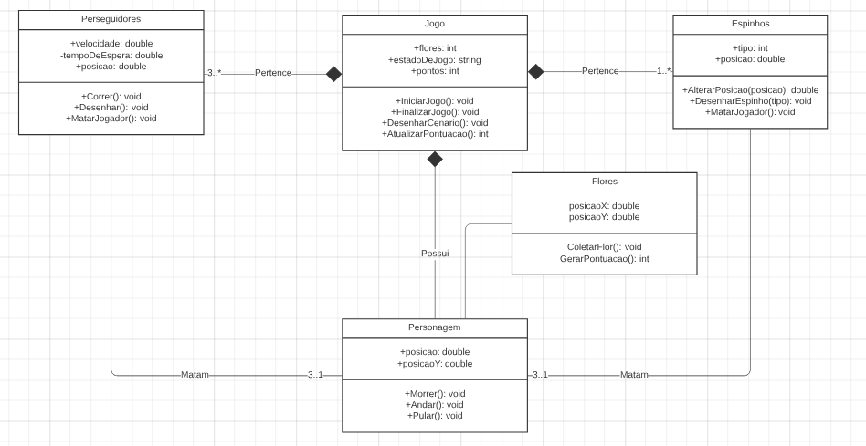

# flowerRunner

Oque é o projeto?
Este projeto deito na linguagem de JavaScript é um jogo feito com base na música "Flores e o Louco" do cantor Fabio Brazza.

# Tecnologias-usadas
Java Script
HTML

# Estado
Em progresso

Processo de desenvolvimento

# Documentação:

## Casos de Uso:

  
  
  
## UML:

  
  ### Definições das classes:
  
  #### Personagem
  
| Métodos  | Definição |
| ------------- | ------------- |
| Morrer()  | Método que apaga o boneco da tela e notifica o jogo para terminar  |
| Andar()  | Método que move o personagem pelo aixo X - determinado pela velocidade  |
| Pular() | Método que move o personagem pelo eixo Y |

  #### Jogo
  
| Métodos  | Definição |
| ------------- | ------------- |
| IniciarJogo()  | Define o estado do jogo como ativo  |
| FinalizarJogo()  | Define o estado do jogo como inativo - ativado quando algo mata o jogador ou quando são coletadas 10 flores|
| DesenharCenario() | Desenha o cenario quando o jogo é iniciado |

  #### Espinhos
  
| Métodos  | Definição |
| ------------- | ------------- |
| AlterarPosicao(posicao)  | Muda a posição do espinho, quando chegar a certa posição ele muda de direção  |
| DesenharEspinho(tipo)  | Desenha os espinhos na tela - O tipo do espinho determina se é um espino voador ou estaico |
| MatarJogador() | Mata o jogador caso tenha contato |

  #### Espinhos
  
| Métodos  | Definição |
| ------------- | ------------- |
| Correr()  | Muda a posição do perseguidor na tela - caso tenha um tempo de espera ele deve esperar  |
| Desenhar()  | Desenha o perseguidor na tela |
| MatarJogador() | Mata o jogador caso tenha contato |

  #### Flor
  
| Métodos  | Definição |
| ------------- | ------------- |
| ColetarFlor()  | Verifica se a  contato com o jogador e retira a flor da tela  |
| GerarPontuacao()  | Retorna uma pontuacao quando coletada |

Você pode acessar o projeto clicando AQUI
